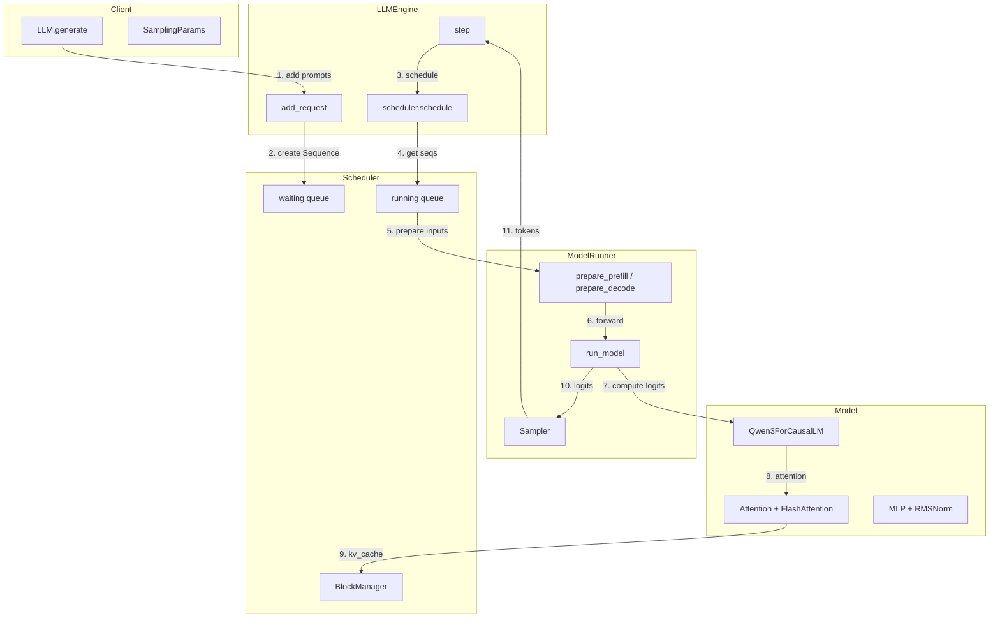
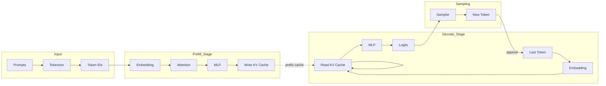
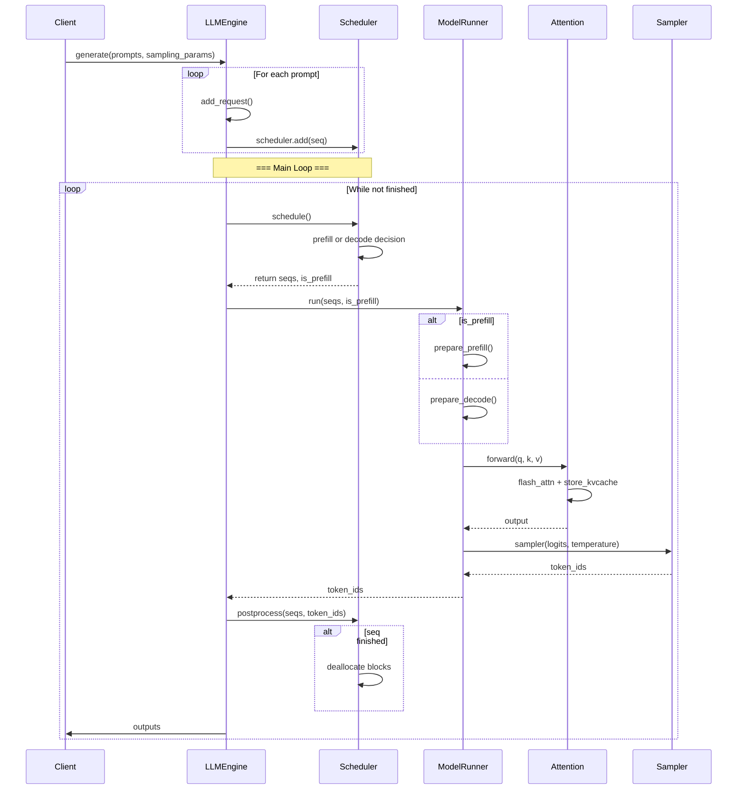
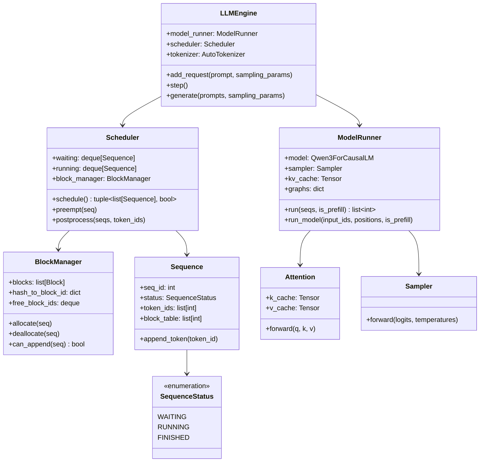
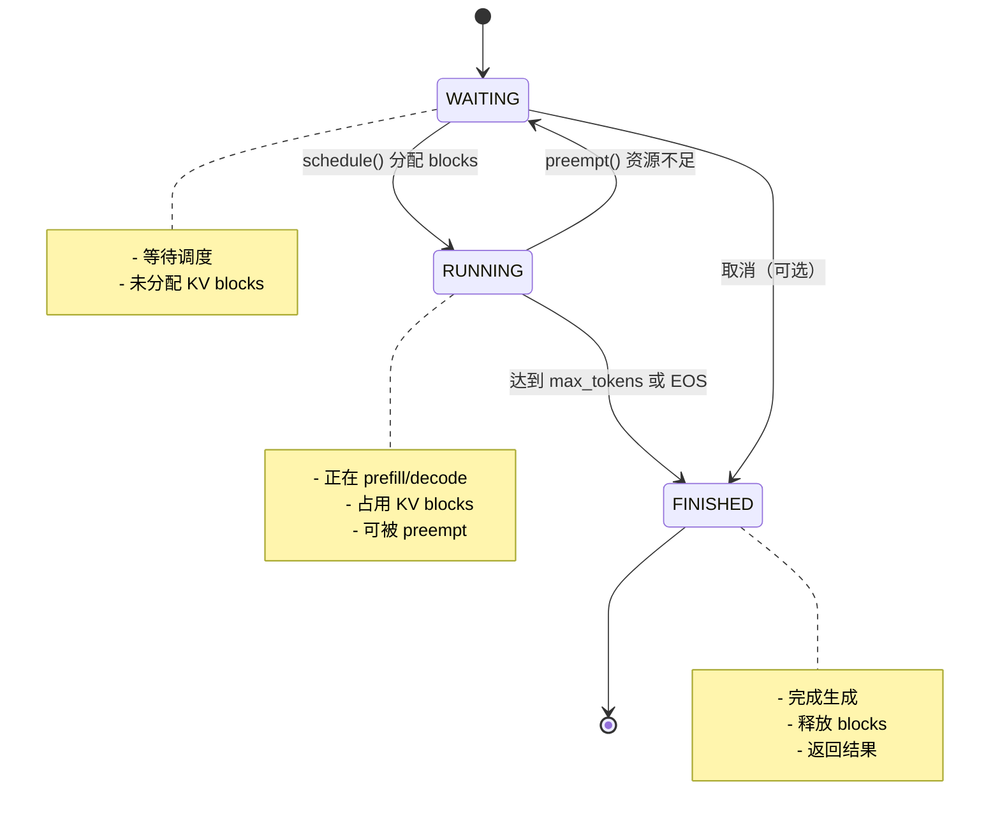

# Nano-vLLM 架构分析文档

> 一个轻量级 vLLM 实现，约 1200 行 Python 代码

---

## 1. 架构概览与核心设计

### 1.1 项目定位

Nano-vLLM 是一个从零构建的轻量级 LLM 推理引擎，API 兼容 vLLM，核心目标：
- **可读性**：约 1200 行代码 vs vLLM 的数万行
- **高性能**：通过 PagedAttention、CUDA Graph、Prefix Caching 等优化
- **易扩展**：支持 Tensor Parallelism、Torch Compile 等

### 1.2 整体架构

```
┌─────────────────────────────────────────────────────────────────┐
│                         LLMEngine                               │
│  ┌─────────────┐  ┌─────────────┐  ┌─────────────────────────┐  │
│  │  Scheduler  │  │ModelRunner  │  │   Multi-Process (TP)    │  │
│  │  - waiting  │  │  - Model    │  │   rank 0: 主进程        │  │
│  │  - running  │  │  - Sampler  │  │   rank 1~N: 工作进程    │  │
│  └──────┬──────┘  └──────┬──────┘  └─────────────────────────┘  │
│         │                │                                     │
│         │    step()      │                                     │
│         │  ┌──────┐      │                                     │
│         │  │seqs  │──────┼────> run_model()                    │
│         │  │tokens│      │                                     │
│         │  └──────┘      │                                     │
│         │                │                                     │
└─────────┼────────────────┼─────────────────────────────────────┘
          │                │
          ▼                ▼
┌─────────────────────────────────────────────────────────────────┐
│                      Core Components                           │
│  ┌──────────────┐  ┌──────────────┐  ┌───────────────────────┐  │
│  │   Sequence   │  │BlockManager  │  │   Qwen3ForCausalLM    │  │
│  │  - token_ids │  │ - KV Cache  │  │   - Layers            │  │
│  │  - block_tbl │  │ - Prefix    │  │   - Attention         │  │
│  └──────────────┘  └──────────────┘  └───────────────────────┘  │
└─────────────────────────────────────────────────────────────────┘
```

### 1.3 核心设计原则

1. **Continuous Batching**：调度器以 batch 为单位调度请求，而非等到整个 batch 完成
2. **PagedAttention**：将 KV Cache 分页管理，避免 Pytorch 动态切片的内存碎片
3. **Prefix Caching**：通过 hash 复用相同前缀的 KV Cache
4. **CUDA Graph**：预编译计算图，减少 kernel launch 开销

---

## 2. Mermaid 组件交互图

### 2.1 组件交互图



### 2.2 数据流图



### 2.3 序列图：单次推理循环



### 2.4 类图



### 2.5 生命周期状态机



---

## 3. 核心组件与关键特性

### 3.1 核心组件

| 组件 | 位置 | 职责 |
|------|------|------|
| `LLMEngine` | `engine/llm_engine.py` | 主入口， orchestration |
| `Scheduler` | `engine/scheduler.py` | 请求调度， batch 决策 |
| `ModelRunner` | `engine/model_runner.py` | 模型执行， CUDA Graph |
| `BlockManager` | `engine/block_manager.py` | KV Cache 分页管理 |
| `Sequence` | `engine/sequence.py` | 单个请求的状态 |
| `Qwen3ForCausalLM` | `models/qwen3.py` | 模型前向 |
| `Attention` | `layers/attention.py` | 注意力计算 + PagedAttention |
| `Sampler` | `layers/sampler.py` | 采样生成 token |

### 3.2 关键特性实现

#### 3.2.1 PagedAttention (BlockManager)

```python
# block_manager.py:59-82
def allocate(self, seq: Sequence):
    # 按 block 为序列分配 KV Cache
    # 支持 prefix caching：通过 hash 复用
    for i in range(seq.num_blocks):
        token_ids = seq.block(i)
        h = self.compute_hash(token_ids, h)
        block_id = self.hash_to_block_id.get(h, -1)
        if block_id == -1:
            block_id = self.free_block_ids[0]  # 分配新 block
        seq.block_table.append(block_id)
```

#### 3.2.2 Prefix Caching

```python
# block_manager.py:36-41
@classmethod
def compute_hash(cls, token_ids: list[int], prefix: int = -1):
    h = xxhash.xxh64()
    if prefix != -1:
        h.update(prefix.to_bytes(8, "little"))  # 链式 hash
    h.update(np.array(token_ids).tobytes())
    return h.intdigest()
```

#### 3.2.3 CUDA Graph

```python
# model_runner.py:217-242
def capture_cudagraph(self):
    # 预编译不同 batch size 的计算图
    for bs in reversed(self.graph_bs):
        graph = torch.cuda.CUDAGraph()
        outputs[:bs] = self.model(input_ids[:bs], positions[:bs])
        with torch.cuda.graph(graph, self.graph_pool):
            outputs[:bs] = self.model(input_ids[:bs], positions[:bs])
        self.graphs[bs] = graph
```

#### 3.2.4 Tensor Parallelism

```python
# llm_engine.py:23-29
# 启动多进程执行模型
for i in range(1, config.tensor_parallel_size):
    process = ctx.Process(target=ModelRunner, args=(config, i, event))
    process.start()

# model_runner.py:26
dist.init_process_group("nccl", "tcp://localhost:2333", ...)
```

### 3.3 核心算法与复杂度

| 算法/操作 | 时间复杂度 | 空间复杂度 |
|-----------|-----------|-----------|
| Attention (FlashAttention) | O(N × d) | O(N + d) |
| Scheduler.schedule() | O(max_num_seqs) | O(max_num_seqs) |
| BlockManager.allocate() | O(num_blocks × block_size) | O(num_blocks) |
| Prefix Cache Lookup | O(1) 平均 | O(num_blocks) |
| CUDA Graph Replay | O(1) | O(1) |

---

## 4. 性能瓶颈与调试

### 4.1 主要性能瓶颈

1. **Kernel Launch Overhead**
   - 每次 forward 大量小 tensor 创建
   - 解决：CUDA Graph 预编译

2. **Memory Fragmentation**
   - 动态 tensor 分配导致碎片
   - 解决：PagedAttention 预分配 block

3. **CPU-GPU Data Transfer**
   - pin_memory + non_blocking 优化

4. **Prefill-Decode Bottleneck**
   - 长 prompt 导致 decode 等待
   - 解决：Continuous batching, Splitfuse (未实现)

### 4.2 调试方法

```python
# 1. 查看 CUDA 内存
torch.cuda.mem_get_info()
torch.cuda.memory_stats()

# 2. Profile 性能
# 使用 torch.profiler 或 nsight-systems

# 3. 调试调度
# scheduler.schedule() 中的日志

# 4. 验证 Prefix Cache
# BlockManager.hash_to_block_id 的 hit rate
```

---

## 5. 入门练习与最小行动

### 5.1 环境准备

```bash
# 安装依赖
pip install torch transformers flash-attn triton xxhash safetensors tqdm

# 下载模型
huggingface-cli download --resume-download Qwen/Qwen3-0.6B \
  --local-dir ~/huggingface/Qwen3-0.6B/ \
  --local-dir-use-symlinks False
```

### 5.2 最小练习

#### 练习 1：运行示例
```bash
python example.py
```

#### 练习 2：添加日志
```python
# 在 llm_engine.py step() 中添加
def step(self):
    seqs, is_prefill = self.scheduler.schedule()
    print(f"[Scheduler] {len(seqs)} seqs, prefill={is_prefill}")  # 添加
    ...
```

#### 练习 3：修改调度策略
```python
# scheduler.py - 调整 max_num_seqs
self.max_num_seqs = config.max_num_seqs  # 默认 512
```

#### 练习 4：禁用 CUDA Graph
```python
llm = LLM(path, enforce_eager=True)  # 强制 eager 模式
```

---

## 6. 开发/维护/扩展最佳实践

### 6.1 代码规范

- **类型提示**：所有函数添加类型注解
- **文档字符串**：关键类/函数添加 docstring
- **单测覆盖**：核心逻辑单元测试

### 6.2 扩展指南

#### 添加新模型

1. 在 `models/` 创建新模型类
2. 继承 `nn.Module`，实现 `forward()` 和 `compute_logits()`
3. 参考 `Qwen3ForCausalLM` 的结构

```python
# 示例：添加 Llama
from nanovllm.models.qwen3 import Qwen3ForCausalLM

class LlamaForCausalLM(nn.Module):
    def __init__(self, config):
        self.model = LlamaModel(config)
        self.lm_head = ParallelLMHead(config.vocab_size, config.hidden_size)
    
    def forward(self, input_ids, positions):
        return self.model(input_ids, positions)
    
    def compute_logits(self, hidden_states):
        return self.lm_head(hidden_states)
```

#### 添加新调度策略

修改 `scheduler.py` 的 `schedule()` 方法：

```python
def schedule(self) -> tuple[list[Sequence], bool]:
    # 自定义 prefill/decode 决策逻辑
    # 例如：基于 prompt 长度选择
    ...
```

### 6.3 性能优化 checklist

- [ ] 使用 `enforce_eager=False` 启用 CUDA Graph
- [ ] 调整 `max_num_batched_tokens` 匹配 GPU 内存
- [ ] 启用 prefix caching（默认开启）
- [ ] 使用 `tensor_parallel_size > 1` 多卡推理

---

## 7. 模块问题排查步骤

### 7.1 常见问题排查清单

#### 问题 1：OOM (Out Of Memory)

- [ ] 降低 `gpu_memory_utilization` (默认 0.9)
- [ ] 减少 `max_num_batched_tokens`
- [ ] 减少 `max_num_seqs`
- [ ] 使用 `enforce_eager=True` 禁用 CUDA Graph（更保守的内存）

#### 问题 2：模型加载失败

- [ ] 检查模型路径是否正确
- [ ] 检查模型格式（支持 safetensors）
- [ ] 检查 `hf_config` 是否正确

#### 问题 3：性能不如预期

- [ ] 确认 CUDA Graph 已启用 (`enforce_eager=False`)
- [ ] 确认使用了 GPU（`torch.cuda.is_available()`）
- [ ] Profile 各阶段耗时

#### 问题 4：多进程失败

- [ ] 检查 NCCL 是否可用
- [ ] 检查端口 2333 是否被占用
- [ ] 检查 `tensor_parallel_size` 设置

### 7.2 调试命令

```bash
# 查看 GPU 使用
nvidia-smi

# 查看 CUDA 错误
CUDA_LAUNCH_BLOCKING=1 python example.py

# Profile
python -m torch.profiler \
    --output_dir ./prof \
    example.py
```

---

## 8. 详细设计文档

### 8.1 调度器设计

```
┌─────────────────────────────────────────────────────────────┐
│                    Scheduler.schedule()                     │
├─────────────────────────────────────────────────────────────┤
│  1. PREPHASE (is_prefill=True)                              │
│     ┌────────────────────────────────────────────┐          │
│     │ while waiting and seats available:        │          │
│     │   - pop seq from waiting                  │          │
│     │   - allocate blocks                       │          │
│     │   - add to running                        │          │
│     │   - add to scheduled                      │          │
│     └────────────────────────────────────────────┘          │
│     return scheduled, True  (if scheduled)                   │
│                                                             │
│  2. DECODE PHASE (is_prefill=False)                         │
│     ┌────────────────────────────────────────────┐          │
│     │ while running and seats available:         │          │
│     │   - check can_append (block available)    │          │
│     │   - allocate new block if needed          │          │
│     │   - add to scheduled                       │          │
│     │   - preempt if no blocks available         │          │
│     └────────────────────────────────────────────┘          │
│     return scheduled, False                                 │
└─────────────────────────────────────────────────────────────┘
```

### 8.2 内存管理设计

```
┌─────────────────────────────────────────────┐
│              KV Cache Layout                │
├─────────────────────────────────────────────┤
│  Block 0  │ Block 1  │ Block 2  │ ...       │
│  [256 tok]│ [256 tok]│ [256 tok]│           │
├─────────────────────────────────────────────┤
│  Sequence A: [0, 1, 2]                      │
│  Sequence B: [0, 1, 2, 3, 4, 5]             │
│                    ↓                        │
│  Block Table:  [0, 1, 2]  (A)               │
│               [0, 1, 3, 4, 5]  (B)           │
└─────────────────────────────────────────────┘
```

### 8.3 数据流设计

```
Input: "Hello, world!"
   ↓
Tokenizer: [12345, 67890, ...]
   ↓
Sequence创建:
  - token_ids = [12345, 67890, ...]
  - status = WAITING
  - block_table = []
   ↓
Scheduler.schedule():
  - allocate blocks
  - status = RUNNING
   ↓
ModelRunner.run(is_prefill=True):
  - prepare_prefill()
  - run_model() → compute_logits()
  - Sampler.sample()
   ↓
Scheduler.postprocess():
  - append_token(new_token)
  - if finished: deallocate, status = FINISHED
   ↓
Output: {"text": "...", "token_ids": [...]}
```

---

## 附录：文件结构

```
nano-vllm/
├── nanovllm/
│   ├── __init__.py
│   ├── llm.py                    # LLM = LLMEngine
│   ├── config.py                  # 配置类
│   ├── sampling_params.py         # 采样参数
│   ├── engine/
│   │   ├── llm_engine.py          # 主引擎
│   │   ├── scheduler.py            # 调度器
│   │   ├── model_runner.py         # 模型运行器
│   │   ├── block_manager.py        # Block 管理
│   │   └── sequence.py             # Sequence 状态
│   ├── layers/
│   │   ├── attention.py            # Attention + Triton
│   │   ├── linear.py                # TP 线性层
│   │   ├── sampler.py               # 采样器
│   │   ├── rotary_embedding.py     # RoPE
│   │   ├── layernorm.py             # RMSNorm
│   │   ├── activation.py            # SiLU
│   │   └── embed_head.py            # Embedding + LM Head
│   ├── models/
│   │   └── qwen3.py                 # Qwen3 模型
│   └── utils/
│       ├── context.py               # 全局上下文
│       └── loader.py                 # 模型加载
├── example.py                       # 示例代码
├── bench.py                         # 性能测试
└── README.md
```
